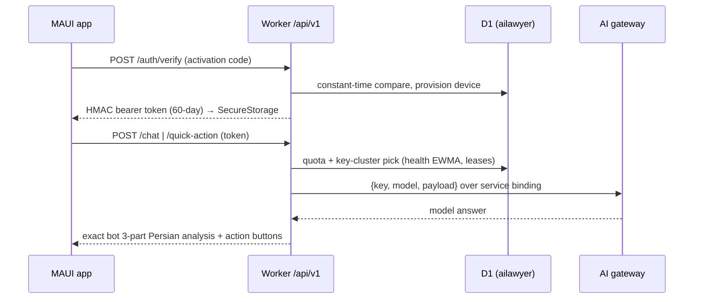

# ⚖️ وکیل هوشمند ایران — Vakil AI

دستیار حقوقی هوشمند ایرانی · اپلیکیشن کراس‌پلتفرم (Android / iOS / macOS / Windows)
ساخته‌شده با **.NET MAUI (net10.0)** — به‌همراه یک **API سرورلس** روی Cloudflare Workers
که همان موتور، همان پرامپت‌ها و همان دکمه‌های ربات تلگرام را به‌صورت بومی در گوشی و دسکتاپ
ارائه می‌دهد. بدون هیچ وابستگی به پلتفرم چت.

🌐 صفحه فرود: [`docs/index.html`](docs/index.html) · ⬇️ دانلود:
<https://github.com/Opselon/Vakil-AI-IRAN/releases/latest> · 📮 API:
<https://vakil-app.samerkhaldounmarefi.workers.dev/api/v1>

---

## 🇮🇷 فارسی

### قابلیت‌ها

- 💬 **مشاوره حقوقی ۲۴/۷** — همان ساختار دقیق پاسخ ربات: ⚖️ موضوع / 📚 تحلیل حقوقی /
  ✅ نتیجه‌گیری و راهکار، به‌همراه سلب مسئولیت مبتنی بر ریسک
- 🧠 **دکمه‌های کنش حرفه‌ای** بعد از هر پاسخ: کالبدشکافی عمیق پرونده، بایدها و نبایدها،
  شبیه‌ساز دادگاه، شبیه‌ساز بازجویی، شانس برد و ریسک مالی، قرمزپوشی حریف، فرصت‌ها و
  تهدیدها — به‌علاوه **دکمه‌های پویای تولیدشده توسط هوش مصنوعی** (مثلاً «📝 تنظیم لایحه …»)
- ✍️ **حالت تنظیم سند** (قرارداد، دادخواست، شکواییه، لایحه دفاعیه، اظهارنامه) با همان
  موتور پیش‌نویس‌نویسی ربات
- 📸 **تحلیل تصویر سند** با Gemini چندوجهی — 🎙 ارسال ویس تا نسخه بعدی **صریحاً غیرفعال**
  نگه داشته شده و این واقعیت در رابط کاربر نیز صادقانه اعلام می‌شود
- 🧾 رندر غنی‌متن فارسی (bold/italic/نقل‌قول/کد/فهرست)، راست‌به‌چپ، تایپوگرافی وزیرمتن،
  تم دارک/لایت، اندیکاتور «در حال فکر کردن» با همان فریم‌های ربات
- 👤 تجربه کوپن روزانه یکسان با ربات — **ریست هر روز ساعت ۲۴:۰۰ به وقت تهران**؛ پروفایل،
  بسته‌ها و قیمت‌ها، راهنما، قوانین و درباره — همه سرویس‌شده از سرور
- 💾 **تاریخچه گفتگو روی همان دستگاه** (SQLite) — مرور آفلاین، ماندگار پس از ریستارت؛
  آینه سمت سرور از طریق `/api/v1/history`
- 🤝 بازارچه وکلا (نسخه ۱ در حال توسعه): فهرست وکلای تأییدشده، مشاوره، نوبت‌دهی —
  مشخصات در `server/DB.md`
- 🔐 ورود با **کد فعال‌سازی** که اپراتور توزیع می‌کند؛ توکن دستگاه HMAC-امضا با انقضای ۶۰ روزه

### دانلود نسخه آماده (GitHub Releases)

هر ریلیز این فایل‌ها را دارد (`v<version>` → Releases):

| فایل | برای چه دستگاهی |
|---|---|
| `vakil-ai-android-arm64-v8a.apk` | گوشی‌های مدرن اندروید (ARM ۶۴-بیت) |
| `vakil-ai-android-armeabi-v7a.apk` | گوشی‌های قدیمی‌تر / اقتصادی |
| `vakil-ai-android-x64.apk` | شبیه‌ساز و تبلت‌های x86 |
| `VakilAI-windows-x64.zip` | ویندوز ۱۰/۱۱ اینتل و AMD (self-contained، بدون نصب دات‌نت) |
| `VakilAI-windows-arm64.zip` | ویندوز روی ARM |
| `SHA256SUMS.txt` | هش SHA256 همه فایل‌های بالا برای راستی‌آزمایی |

iOS / MacCatalyst از همین کدبیس روی مک قابل‌ساخت است، اما به‌دلیل الزام امضای اپل از CI
منتشر نمی‌شود.

**راستی‌آزمایی SHA256** — هر بار که APK/ZIP را از جایی غیر از GitHub می‌گیرید:

```bash
# Linux / macOS / Termux
curl -LO https://github.com/Opselon/Vakil-AI-IRAN/releases/latest/download/SHA256SUMS.txt
curl -LO https://github.com/Opselon/Vakil-AI-IRAN/releases/latest/download/vakil-ai-android-arm64-v8a.apk
sha256sum -c SHA256SUMS.txt --ignore-missing
```

```powershell
# Windows PowerShell — مقدار را با خطِ همان فایل در SHA256SUMS.txt مقایسه کنید
Get-FileHash .\VakilAI-windows-x64.zip -Algorithm SHA256
```

### جریان فعال‌سازی

1. اپ را نصب و اولین بار اجرا می‌کنید.
2. **کد فعال‌سازی** را وارد می‌کنید؛ این کد را اپراتور (مخاطب پشتیبانی / کانال فروش)
   در اختیارتان می‌گذارد — کد واقعی هیچ‌جا در مستندات یا داخل اپ منتشر/جاسازی نمی‌شود.
3. اپ یک هویت دستگاه پایدار می‌سازد و به `POST /api/v1/auth/verify` می‌فرستد؛ سرور کد را
   با مقایسه زمان‌ثابت می‌سنجد، کاربر/دستگاه را ثبت و یک **توکن bearer ارسالی از HMAC**
   (انقضا ۶۰ روز) برمی‌گرداند.
4. توکن در **SecureStorage** همان دستگاه (keystore/keychain) ذخیره می‌شود و از این پس
   درخواست‌ها با آن امضا می‌شوند؛ حذف اپ = نشست جدید و نیاز مجدد به کد.

### سیاست تولید: بدون موک، بدون شبیه‌ساز جعلی

در مسیر تولید **هیچ** پاسخ ساختگی، متن fallback یا داده نمونه وجود ندارد: هر آنچه کاربر
می‌بیند از موتور زنده سمت سرور می‌آید. ربات و اپ از یک منبع واحد تغذیه می‌شوند — متن
پرامپت‌ها/دکمه‌ها/صفحه‌ها در زمان build از workerِ پروداکشنِ ربات استخراج می‌شود، پس
انحراف واژگان بین ربات و اپ ممکن نیست. داده‌های نمونه در سراسر ریلز هم ممنوع است
(empty state صادقانه بهتر از داده ساختگی است). موک و D1/درگاه استاب‌شده **فقط** در تست
آفلاین (`npm run smoke`) مجاز است، نه در مسیر کاربر.

### امنیت

- هیچ کلید API روی کلاینت نیست؛ کلیدهای Gemini فقط در D1 (`gemini_api_keys`) می‌مانند،
  هرگز از API بیرون نمی‌روند و لاگ نمی‌شوند (فقط دنباله ماسک‌شده `...mMBQ` در تشخیص خطا).
- توکن نشست اپ در SecureStorage (keystore/keychain) ذخیره می‌شود؛ سمت سرور فقط
  **هش** توکن نگه داشته می‌شود.
- تاریخچه گفتگو روی دستگاه شماست؛ آینه سرور صرفاً برای بازیابی بین‌دستگاهی است و
  محتوای چت در لاگ‌ها نمی‌آید.
- اعتبارسنجی کد فعال‌سازی با مقایسه زمان‌ثابت انجام می‌شود؛ رکوردهای توکن منقضی
  هر ۶ ساعت توسط cron پاک می‌شوند.

---

## 🇬🇧 English

A modern Persian legal-assistant client for iOS, Android, macOS and Windows
(.NET MAUI / net10.0), powered by the **Vakil AI serverless API** on Cloudflare
Workers — the exact same legal engine, prompts and actions that power the
Telegram bot, with **zero** dependency on any chat platform.

> The app talks to **one** surface: `/api/v1/*` on the deployed Cloudflare
> Worker (built from `server/`). API keys never touch the client; quota,
> history and the key cluster live in D1.

### Architecture (Clean / DDD / SOLID)

```
Vakil-AI-IRAN (MAUI app — Presentation: Pages/, Controls/, Rendering/, Services/)
 ├─ src/VakilAI.Domain           entities, value objects, repository contracts
 ├─ src/VakilAI.Application      ChatService state machine, ports (IAppApi…),
 │                               Persian rich-text parser — no platform deps
 ├─ src/VakilAI.Infrastructure   AppApiClient (HTTP/2, retries, typed errors),
 │                               SQLite stores, token-vault delegates, crypto RNG
 ├─ server/                      Cloudflare Worker «vakil-app»: /api/v1 app API
 │                               sharing the bot's D1 (key cluster, quota, mirror)
 └─ tests/VakilAI.Core.Tests     237 xUnit tests (parser, service, contracts)
```

Request flow:



- The engine lives **server-side only** (`server/dist/vakil-app-worker.js`); every AI
  capability is an API call. No prompts, keys, or fallback text in the client.
- `IChatService` orchestrates the full conversation state machine
  (idle → thinking-frames → response/pages/quota), platform-free & unit-tested.
- D1 key-cluster failover (sticky sessions, leases, EWMA health, quarantine
  budgets) is documented in [`server/DB.md`](server/DB.md).

### Server / worker endpoints

Base: `https://vakil-app.samerkhaldounmarefi.workers.dev` (CORS enabled; worker
`vakil-app` serves the app API only — Telegram webhooks stay on the bot worker).

| Endpoint | Auth | Purpose |
|---|---|---|
| `POST /api/v1/auth/verify` | channel code | Constant-time code check; provisions synthetic user + device; returns HMAC bearer token (60-day) |
| `POST /api/v1/chat` | token | Text/image → exact bot validation & limit pages; drafting state machine; daily quota (Tehran-midnight reset) |
| `POST /api/v1/quick-action` | token | Static pages zero-cost; `deep_analysis` + dynamic buttons via the dual engine (DeepSeek-first, Gemini fallback) |
| `POST /api/v1/history` | token | Server mirror rows — local SQLite stays the client source of truth |
| `GET /api/v1/health` | public | Liveness `{"ok":true}` — used by the landing page, CI and deploy probes |
| `POST /api/v1/auth/*` · `/lawyers/*` · `/consultations/*` · `/payments/*` · `/admin/*` | accounts | Marketplace V1 surface (in development) — see `server/DB.md` |

### Quick start (contributors)

Prerequisites: the pinned .NET SDK (`global.json`, net10.0 toolchain), MAUI
workloads, and for the server path Node 22.

```bash
dotnet restore
dotnet build Vakil-AI-IRAN.csproj -f net10.0-windows10.0.19041.0 -c Debug   # Windows head
dotnet build Vakil-AI-IRAN.csproj -f net10.0-android -c Debug               # Android head
dotnet test tests/VakilAI.Core.Tests -c Release --nologo                    # 237 tests

cd server
npm run build          # rebuild dist/vakil-app-worker.js from the pristine bot worker
npm run check          # integrity: required symbols defined exactly once
npm run smoke          # 14 offline integration tests (stubbed D1/gateway)
```

Operator-only (needs Wrangler credentials): `npm run deploy`,
`npm run secret:token` / `secret:code`, `npm run test:live` (11 live tests).
The activation code (`APP_CHANNEL_CODE`) is set once as a Worker secret and is
**never** written into this repo or any doc.

Full loop, branch/PR policy and the verify-before-push rule:
[`CONTRIBUTING.md`](CONTRIBUTING.md) · server guide:
[`server/README.md`](server/README.md).

### CI/CD

- [`.github/workflows/ci.yml`](.github/workflows/ci.yml) — 237 core tests, worker
  syntax + integrity + offline smoke, Android & Windows build gates on every push/PR
- [`.github/workflows/release.yml`](.github/workflows/release.yml) — GitHub Release with
  **per-CPU APKs** (arm64-v8a / armeabi-v7a / x64, optional keystore signing),
  **self-contained Win-x64 & Win-arm64 EXE zips**, plus `SHA256SUMS.txt`
- [`.github/workflows/deploy-worker.yml`](.github/workflows/deploy-worker.yml) — manual
  gate that publishes only the artifact CI validated, then probes `/api/v1/health`

### Status

- App API: **live** on the worker above — 14/14 offline smokes, 11/11 live smokes,
  237/237 unit tests ✅
- Android & Windows heads: compile-verified in CI; iOS/MacCatalyst buildable from macOS
- Voice input: intentionally disabled until a later release (the UI says so honestly)
- Multi-device history restore & Marketplace V1: API ready, UI in active development

© Vakil AI — قانون جمهوری اسلامی ایران.
